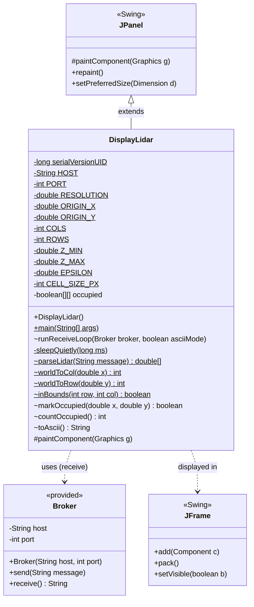

# DisplayLidar

Implements User Story #35: combine LiDAR point data into a single 2D map of the
environment and display it.

## UML Class Diagram

`DisplayLidar` extends `JPanel`, so the class is both the map and the drawing
surface. It depends on the provided `Broker` class to receive data, and on a
`JFrame` to show the panel.

## Design

`DisplayLidar` receives `LIDAR,X,Y,Z` messages from the `Broker` and stores them
in an occupancy grid: a `boolean[100][100]` where each cell covers 0.1 m x 0.1 m
of the world, giving a 10 m x 10 m map with its origin at (-5.0, -5.0).

`parseLidar` converts one message into x, y and z, returning `null` for anything
malformed so a bad message cannot stop the program. Points are ignored unless
their z value falls between `Z_MIN` and `Z_MAX`, which keeps floor returns and
points above the robot out of the map.

`worldToCol` and `worldToRow` convert meters into cell indices. `worldToRow`
flips the y axis, because screen row 0 is the top of the window while world y
increases upward. Both add an epsilon before flooring: in Java
`(-0.9 + 5.0) / 0.1` evaluates to 40.99999999999999, which would otherwise floor
into the neighboring cell. `markOccupied` then marks the cell, after checking it
falls inside the map with `inBounds`.

`paintComponent` draws every occupied cell as a black square and marks the
sensor origin (0, 0) with a red dot.

`Broker.receive` blocks until a message arrives, so `runReceiveLoop` runs on a
background thread. Running it on the Event Dispatch Thread would freeze the
window. Because that thread writes to the grid while the Event Dispatch Thread
reads it to paint, `markOccupied` is `synchronized` and `paintComponent`
synchronizes on the same lock.

## Testing

Start `TestDisplayLidar`, then run `DisplayLidar`. The simulator sends 445
points at 35 ms each, so the room outline and the three interior obstacles
appear over roughly 16 seconds.

Running `DisplayLidar --ascii` prints the same map as text instead of opening a
window, which was used to verify the grid before the display existed.
